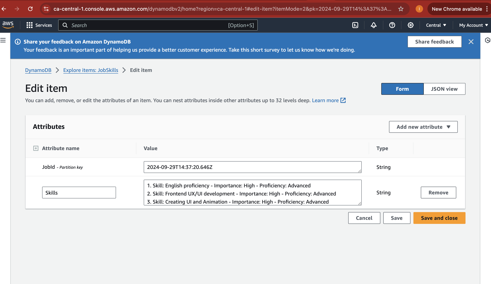

# Job Description Analyzer API

The Job Description Analyzer API extracts skill requirements from job descriptions, providing insights into the importance and proficiency level of each skill mentioned.

## Environment Variables

- `OPENAI_API_KEY`: Your OpenAI API key.
- `AWS_ACCESS_KEY_ID`: Your AWS access key ID.
- `AWS_SECRET_ACCESS_KEY`: Your AWS secret access key.

## Assumptions

- The skills are inferred based on keywords like "Must have" (High importance) or "Nice to have" (Low importance).
- Used API Gateway for interaction.

## Deployment Instructions

- Ensure you have AWS CDK installed (`npm install -g aws-cdk`)
- Run `cdk deploy` to deploy the stack

## Testing Instructions

- After deploying, send a POST request to the API Gateway URL with a job description in the body

## Screen shorts

Result:

1. Skill: English proficiency - Importance: High - Proficiency: Advanced
2. Skill: Frontend UX/UI development - Importance: High - Proficiency: Advanced
3. Skill: Creating UI and Animation - Importance: High - Proficiency: Advanced
4. Skill: Experience in working for small teams or startups - Importance: High - Proficiency: Advanced
5. Skill: Communication with stakeholders - Importance: High - Proficiency: Advanced
6. Skill: Leading a team as

## Open AI Resources:

1. https://pub.towardsai.net/openai-just-released-gpt-3-text-davinci-003-i-compared-it-with-002-the-results-are-impressive-dced9aed0cba
2. https://platform.openai.com/docs/api-reference/authentication

## AWS resources

1. https://docs.aws.amazon.com/cdk/v2/guide/environments.html
2. Amazon Q and Chat GPT
   Asked questions like
3. how to configure Lamda with API Gateway
4. Permissions required for DynamoDb, Lamda for AWS IAM users

Links used:

1. https://docs.aws.amazon.com/cdk/v2/guide/environments.html
2. https://docs.aws.amazon.com/AWSJavaScriptSDK/v3/latest/Package/-aws-sdk-core/
